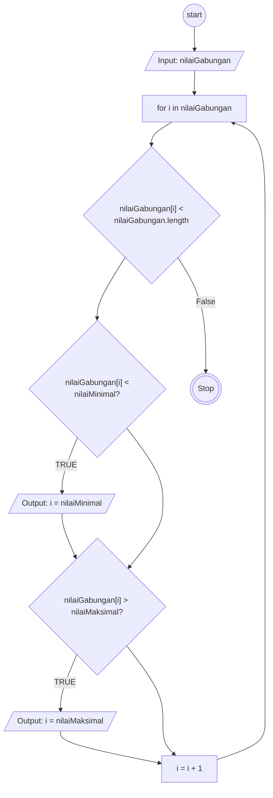
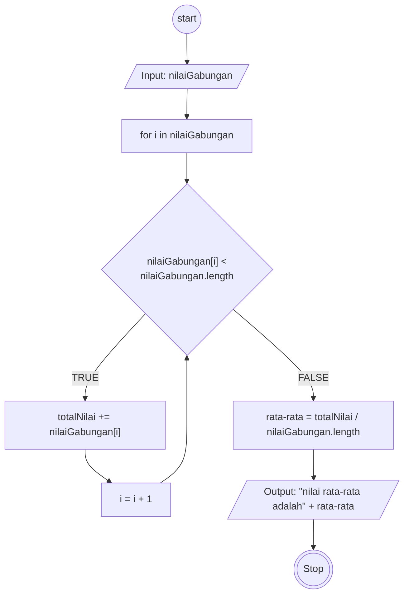

```mermaid
flowchart TD
A@{ shape: circle, label: "start" }

B@{ shape: lean-r, label: "Input: nilaiGabungan" } 

C@{ shape: rect, label: "for i in nilaiGabungan" } --> Y

G@{ shape: rect, label: "nilaiGabungan" }

D@{ shape: diamond, label: " nilaiGabungan[i] < nilaiMinimal?" } 

G@{ shape: diamond, label: "nilaiGabungan[i] > nilaiMaksimal?" }

E@{ shape: lean-r, label: "Output: i = nilaiMinimal" } --> G

H@{ shape: lean-r, label: "Output: i = nilaiMaksimal" } --> F

Y@{ shape: diamond, label: " nilaiGabungan[i] < nilaiGabungan.length" } -->|False| Z

Z@{ shape: dbl-circ, label: "Stop" }

F@{ shape: rect, label: "i = i + 1"} 

A --> B
B --> C
D -- TRUE --> E
G -- TRUE --> H
F --> C
G --> F

Y --> D
D --> G
```

```mermaid
flowchart TD
A@{ shape: circle, label: "start" } --> B

B@{ shape: lean-r, label: "Input: nilaiGabungan" } --> C

C@{ shape: rect, label: "for i in nilaiGabungan" } --> D

D@{ shape: diamond, label: " nilaiGabungan[i] < nilaiGabungan.length" } 

E@{ shape: rect, label: "i = i + 1"}

G@{ shape: rect, label: "totalNilai += nilaiGabungan[i]" }

I@{ shape: process, label: "rata-rata = totalNilai / nilaiGabungan.length" }


J@{ shape: lean-r, label: "Output: \"nilai rata-rata adalah\" + rata-rata" } 


F@{ shape: dbl-circ, label: "Stop"}

D -- TRUE --> G
G --> E
E --> D
D -- FALSE --> I
I --> J
J --> F
```
